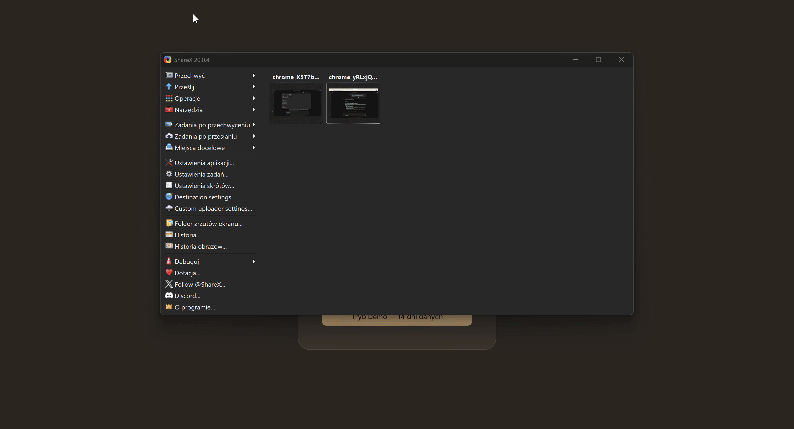
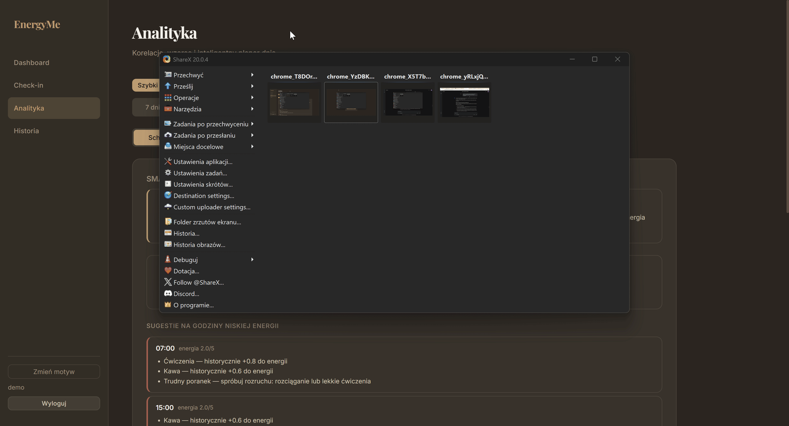
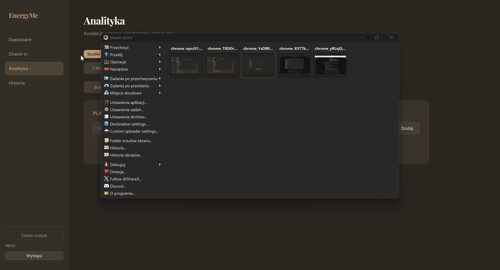
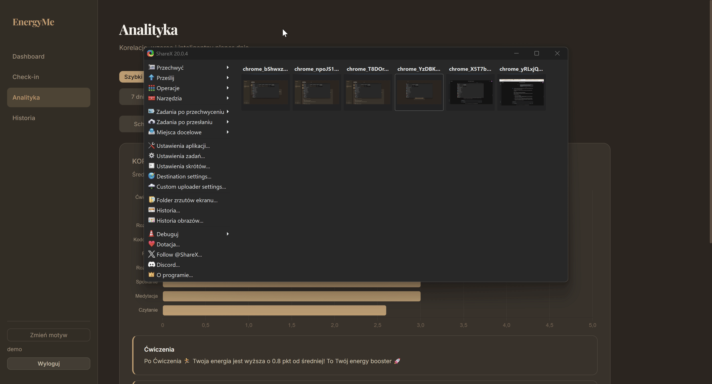
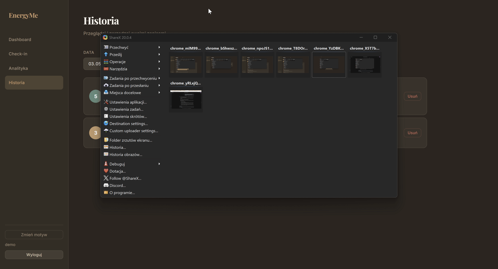

# EnergyMe — Energy & Focus Tracker

> **Discover your natural energy rhythm.**

A full-stack MVP web application for tracking energy levels, focus, and productivity throughout the day. EnergyMe analyzes your historical patterns and generates intelligent, context-aware recommendations to help you plan an optimal day.

---

## Demo

### Logging in & Tracking Energy


### Smart Scheduler — AI-Powered Day Analysis


### Task Planner — Automatic Task Scheduling


### Heatmap & Activity Correlations


### Check-in History & Theme Switching


---

## Features

- **Energy Check-ins** — Log your energy level (1–5), focus, activity, emotions, and notes throughout the day
- **Smart Scheduler** — Generates an optimal daily plan based on your historical energy patterns, identifying your golden hour, deep work blocks, and break times
- **Context-Aware Tips** — For low-energy hours, the system suggests activities that *historically boosted your energy* and are *appropriate for the time of day* (e.g., won't suggest lunch at 11 AM or coffee at 9 PM)
- **Task Planner** — Input your tasks with priority and duration; the system assigns them to optimal time slots (high-priority tasks → peak energy hours, low-priority → dip hours)
- **Activity Correlations** — Discover which activities and emotions raise or lower your energy
- **Energy Heatmap** — Visualize energy patterns across days of the week and hours
- **Check-in History** — Browse, review, and delete past entries by date
- **Custom Activities** — Define your own activities beyond the built-in options
- **Flexible Date Ranges** — Analyze data from any period (7–90 day presets or custom date range)
- **Demo Mode** — One-click login with 14 days of realistic seed data
- **Dark / Light Theme** — Coffee-themed design with a warm, professional aesthetic

---

## Technical Overview

### Tech Stack

| Layer          | Technology                                        |
|----------------|---------------------------------------------------|
| **Backend**    | Python 3.12 · FastAPI · SQLAlchemy · Pydantic v2  |
| **Frontend**   | React 19 · TypeScript · Vite · Chart.js           |
| **Database**   | SQLite (file-based, zero config)                  |
| **Auth**       | JWT tokens (python-jose) · bcrypt (passlib)       |
| **HTTP**       | REST API · Axios · Vite dev proxy                 |
| **Styling**    | Vanilla CSS · CSS Custom Properties design system |

### Interesting Technical Decisions

**Smart Scheduler with Activity Time Windows**
The scheduling algorithm doesn't just look at average energy per hour — it applies real-world constraints via an `ACTIVITY_WINDOWS` dictionary that defines when each activity makes sense (meals: 7–9, 12–14, 18–20; coffee: 7–11, 13–16; exercise: 6–9, 16–20; etc.). This prevents absurd suggestions like "have lunch at 11 AM" or "drink coffee at 9 PM."

**Remedial Suggestions Based on Historical Data**
For low-energy hours, instead of generic advice, the system mines the user's own check-in history to find which activities historically correlated with higher energy — then filters them through the time-window constraints. This produces personalized, actionable tips like: *"Coffee — historically +0.8 to your energy"* only during hours when coffee actually makes sense.

**Energy Profile–Based Task Assignment**
The task planner builds an hourly energy profile from N days of data, then uses a greedy algorithm: high-priority tasks are assigned to peak-energy slots, low-priority tasks to dip slots (to preserve high-energy hours for important work). It checks for contiguous slot availability for multi-hour tasks.

**CSS Design System with Custom Properties**
The entire UI is built on a CSS Custom Properties design system (`--bg-primary`, `--accent`, `--energy-1` through `--energy-5`, etc.) that powers both dark and light themes with a single `[data-theme]` attribute toggle — no CSS framework needed.

---

## Project Structure

```
energy-tracker/
├── backend/
│   ├── app/
│   │   ├── routers/           # API endpoints
│   │   │   ├── auth.py        #   Registration, login, JWT
│   │   │   ├── checkins.py    #   CRUD for check-ins
│   │   │   └── analytics.py   #   Insights, scheduler, correlations, task planner
│   │   ├── services/          # Business logic
│   │   │   ├── analytics.py   #   Daily insights & recommendations
│   │   │   ├── correlations.py#   Activity/emotion ↔ energy analysis
│   │   │   └── scheduler.py   #   Smart scheduler & task planner (with time windows)
│   │   ├── auth.py            # JWT creation, password hashing, token verification
│   │   ├── config.py          # Environment config (SECRET_KEY, DB URL)
│   │   ├── database.py        # SQLAlchemy engine & session factory
│   │   ├── main.py            # FastAPI app, CORS, lifespan events
│   │   ├── models.py          # ORM models (User, CheckIn)
│   │   ├── schemas.py         # Pydantic request/response schemas
│   │   └── seed.py            # Realistic demo data generator
│   └── requirements.txt
├── frontend/
│   ├── src/
│   │   ├── api/client.ts      # Axios instance with JWT interceptor
│   │   ├── components/        # Reusable UI components
│   │   │   ├── CheckInForm.tsx    # Multi-step check-in form
│   │   │   ├── SmartScheduler.tsx # Schedule timeline + remedial tips
│   │   │   ├── TaskPlanner.tsx    # Task input & optimized plan display
│   │   │   ├── EnergyChart.tsx    # Chart.js energy line chart
│   │   │   ├── HeatMap.tsx        # Weekly energy heatmap grid
│   │   │   ├── CorrelationChart.tsx # Activity correlation bars
│   │   │   └── Layout.tsx         # Sidebar navigation layout
│   │   ├── pages/             # Route-level views
│   │   │   ├── DashboardPage.tsx  # Overview + quick check-in
│   │   │   ├── CheckInPage.tsx    # Full check-in form
│   │   │   ├── AnalyticsPage.tsx  # Tabbed analytics (scheduler, planner, correlations, heatmap)
│   │   │   ├── HistoryPage.tsx    # Check-in history with delete
│   │   │   └── LoginPage.tsx      # Auth + demo mode
│   │   ├── utils/constants.ts # TypeScript interfaces & constants
│   │   ├── App.tsx            # React Router setup
│   │   └── index.css          # Full CSS design system
│   └── vite.config.ts         # Vite config with API proxy
├── gifs/                      # Demo recordings
├── .gitignore
└── README.md
```

---

## Getting Started

### Prerequisites

- **Python** 3.10+
- **Node.js** 18+

### 1. Clone the repository

```bash
git clone https://github.com/HubertSiemaszko/EnergyMe.git
cd EnergyMe
```

### 2. Start the Backend

```bash
cd backend
pip install -r requirements.txt
python -m uvicorn app.main:app --reload --port 8000
```

The API will be available at `http://localhost:8000`.
Interactive API docs: `http://localhost:8000/docs`

### 3. Start the Frontend

```bash
cd frontend
npm install
npm run dev
```

The app will be available at `http://localhost:5173`.

### 4. Try it out

Open `http://localhost:5173` and click **"Demo Mode — 14 days of data"** to instantly explore the app with pre-generated realistic data.

---


## AI Tools Usage

This project was developed using an **AI-assisted development** workflow, leveraging LLM-based tools to accelerate various phases of the software development lifecycle.

- **Antigravity (Google DeepMind)** — Used as a collaborative coding agent for scaffolding initial project structure, brainstorming architectural decisions, and accelerating repetitive implementation tasks. Particularly useful for generating boilerplate code and iterating on the CSS design system.
- **Manual oversight** — All AI-generated code was reviewed, tested, and refined manually. Product decisions, feature priorities, the scheduling algorithm design, and UX direction were driven entirely by me.
